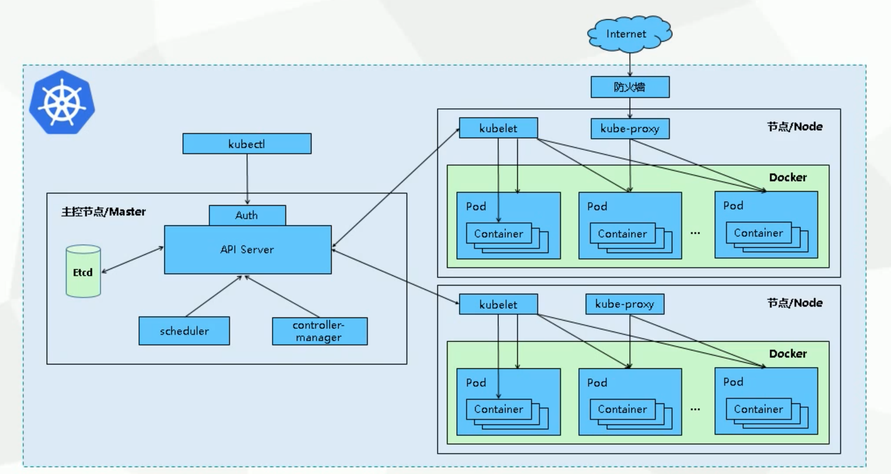
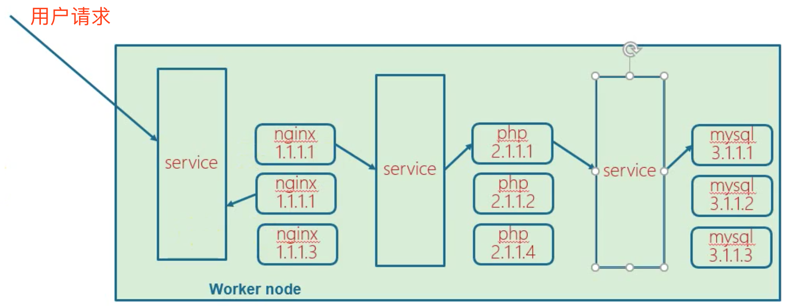
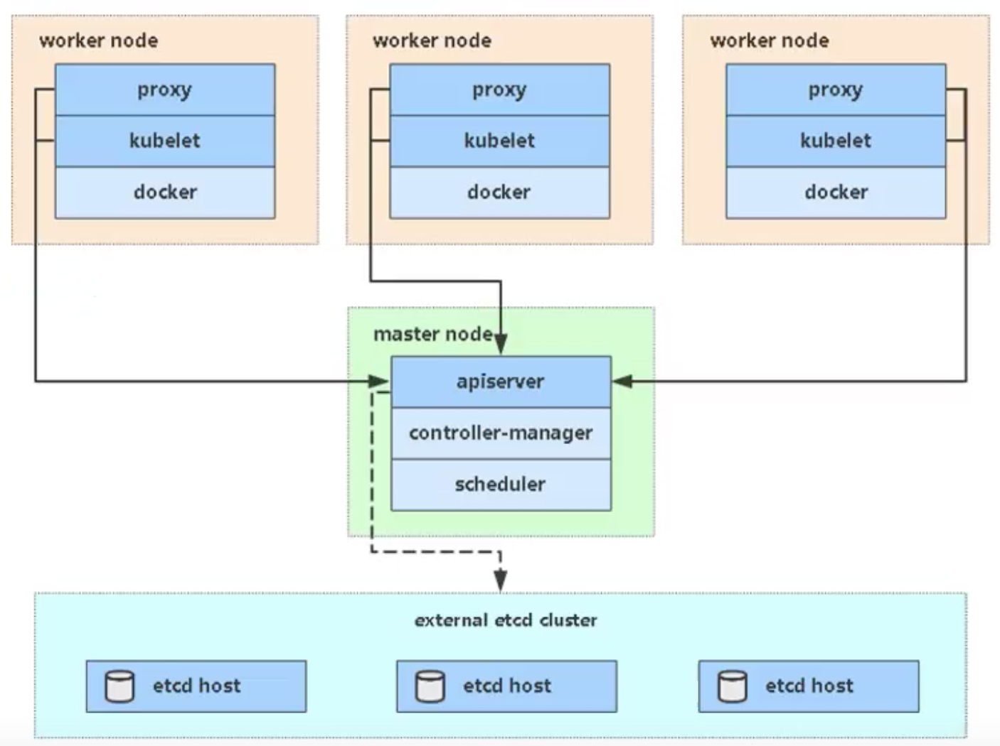
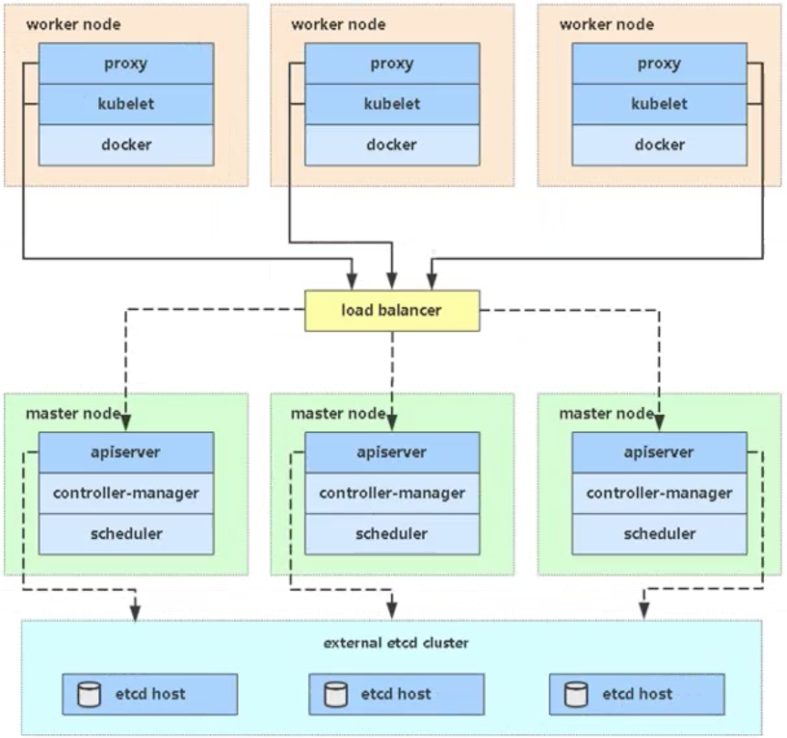

## K8S 学习

### Kubernetes是什么

- K8S本质上就是一组服务器集群，K8S可以在集群的各个节点上运行特定的docker容器。
- Kubernetes是Google在2014年开源的一个容器集群管理系统。
- K8S用于容器化应用程序的部署，扩展和管理。
- K8S提供了容器编排，资源调度，弹性伸缩，部署管理，服务发现等一系列功能。
- Kubernetes目标是让部署容器应用简单高效。

### Kubernetes特性

- 自我修复
- 弹性伸缩
- 自动部署和回滚
- 服务发现和负载均衡
- 机密和配置管理
- 存储编排
- 批处理

### Kubernetes集群分为两类节点

- master：主节点

  - master节点的组件

    - kube-apiserver ：接收客户端操作K8S的指令

      Kubernetes API，集群的统一入口，各组件协调者，以**RESTful API**提供接口服务，所有对象资源的增删改查和监听 操作都交给APIServer处理后再提交给Etcd存储。

    - kube-schduler ：调度节点，从多个node节点的组件中选举一个来启动服务

      根据调度算法为新创建的Pod选择一个Node节点，可以任意部署，可以在同一个节点上，也可以部署在不同的节点上。

    - kube-controller manager ：控制节点，向node节点的kubelet发送指令的

      处理机器中常规后台任务，一个资源对应一个控制器，而Controller Manager就是负责管理这些控制器的。

    - etcd ：分布式键值存储系统。用于保存集群状态数据，比如Pod、Service等对象信息。

- node：工作节点

  - worker节点的组件：

    - Kubelet ：向docker发送指令管理docker容器的

      kubelet是Master在Node节点上的Agent，管理本机运行容器的生命周期，比如创建容器、Pod挂在数据卷、下载secret、获取容器和节点状态等工作。kubelet将每个Pod转换成一组容器。

    - kube-proxy ：管理docker容器的网络

      在Node节点上实现Pod网络代理，维护网络规则和四层负载均衡工作。

    - docker或rocket

      容器引擎，运行容器。

### Kubernetes架构模型

### Kubernetes核心概念

- **Pod**
  - 最小部署单元（K8S中不可以直接启动容器，必须通过Pod）
  - 一组容器的集合，又称容器组
  - 一个Pod中的容器共享网络命名空间
  - Pod是短暂的

- Controllers：控制器，控制pod，启动、停止、删除
  - ReplicaSet：确保预期的Pod副本数量
  - Deployment：无状态应用部署
  - StatefulSet：有状态应用部署
  - DaemonSet：确保所有Node运行同一个Pod
  - Job：一次性任务
  - Cronjob：定时任务

- Service：关联一组Pod（服务发现，服务注册）

  - 防止Pod失联
  - 定义一组Pod的访问策略

  - 上图理解

    

- Label：标签，附加到某个资源上（用于关联对象、查询和筛选）

  - 一组pod有一个统一的标签，service是通过标签和一组pod进行关联的

- Namespace：命名空间（将对象逻辑上隔离）

  - 用来隔离Pod的运行环境，默认情况下Pod是可以互相访问的
  - 为开发环境、测试环境、生产环境分别准备不同的名称空间，进行隔离

### 生产环境K8S平台规划

- **单Master集群**

  

- **多Master集群（HA）**

  