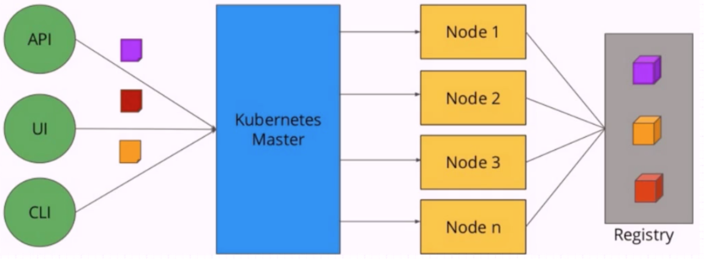
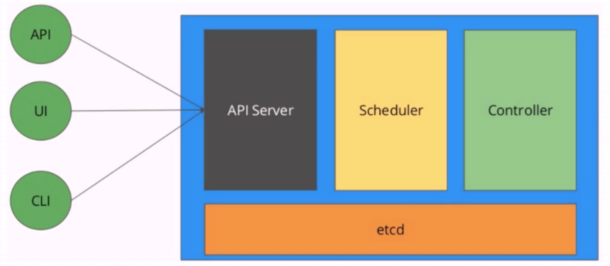
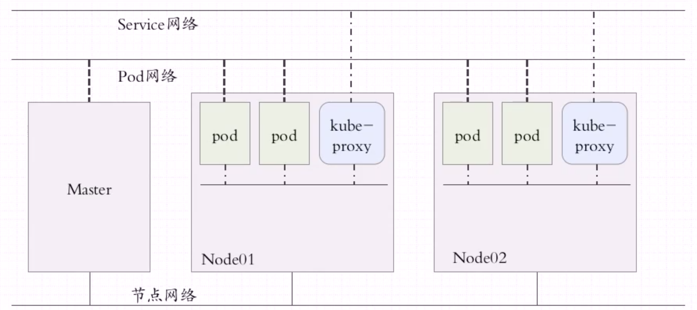
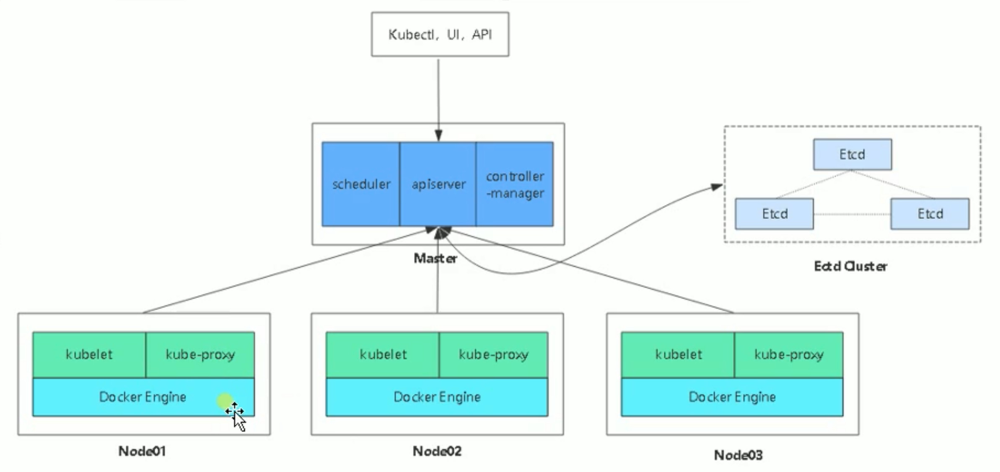

## Kubernetes 学习笔记

### 什么是Kubernetes

kubernetes是一个开源平台，用于跨主机群集自动执行应用程序容器的部署、伸缩、分类和操作(运维)，提供以容器为中心的基础架构

### Kubernetes组成

- Kubernetes 简单架构图

  

- Master 控制节点

  - Master节点主要部件

    

    - kube-API Server 接口端：接收客户端请求的入口，并且检查用户发送过来的请求命令是否符合语法规范，如果符合规范将其创建保存在ETCD中
    - kube-Scheduler 调度器：用来检查节点服务状态，选择使用哪个节点处理服务
    - kube-Controller 控制器：用来创建服务、监听服务
    - etcd 数据端：主要用于存储描述容器的 K:V (key:value)
    - cloud-controller-manager：通常需要把K8S部署在云环境中才会用到

- Node 处理节点

  - Node节点主要部件

    

    - kubelet：它也会 “watch” 着Master中API Server上的资源变动，如果某一个Scheduler调度某一个容器给一个节点之后，这个节点可以通过API Server看到调度结果是由自己负责执行的。使用kubelet自己启动的Pod配称为进程Pod。
    - kube-proxy：
    - Container Runtime：容器引擎（docker或“CRI”接口下的其他容器引擎）
    - Pod：在K8S上，容器是被重新封装过得，封装之后的容器被称为Pod，可以理解为 `它是容器的又一层外壳`。**K8S上运行的核心基本单元是POD，而不是容器。一个Pod中可以存在多个容器。**Pod中多个容器的网络使用的是联盟模式。Pod的底层还会有一个不经常被关注到的容器(基础架构容器: infra container)

  - Addons

    主要用于服务注册和服务发现

    - 主要部件
      - DNS：服务注册和服务发现
      - CNI：容器网络接口的实现，比如：（flannel、calico、...）
      - Web UI (Dashboard)：图形界面
      - Container Resource Monitoring：
      - Cluster-level Logging：

- K8S对象：

  - Pod：
  - Service：
  - NameSpace：
  - Volume：

### K8S网络



### K8S架构图




------

### K8S部署要点

- 测试环境
  - 可以使用单Master，单etcd实例
  - Node主机数量按需而定
  - nfs或glusterfs等存储系统
- 生产环境
  - 高可用etcd集群，建立3、5或7个节点
  - 高可用Master
    - kube-apiserver无状态，可多实例
      - 借助于keepalived进行vip流动实现多实例冗余；
      - 或在多实例前端通过HAProxy或Nginx反向代理，并借助于keepalive对代理服务器进行冗余
    - kube-scheduler及kube-controller-manager各自只能有一个活动实例，但可以有多个备用
      - 各自自带leader选举的功能，并且默认处于启用状态
  - 多Node主机，数量越多越好，冗余能力超强
  - ceph、glusterfs、iSCSI、FC SAN及各种云存储等

### K8S部署工具

- 常用的部署环境
  - IaaS公有云环境：AWS，GCE，Azure等
  - IaaS私有云或公有云环境：OpenStack和vSphere等
  - Baremetal环境：物理服务器或独立的虚拟机等
- 常用的部署工具
  - kubeadm：docker官方出品
  - kops：专用于AWS这种虚拟机(公有云)之上的这种部署机制
  - kubespray
  - Kontena Pharos
- 其他二次封装的常用发行版
  - Rancher：Rancher Labs公司发行的K8S
  - Tectonic：CoreOS公司发行的K8S
  - Openshift：红帽二次发行的K8S，在K8S之上使得K8S的部署更加简便

### K8S搭建的几种方式

- kubeadm
  - 官方开发的为了方便K8S部署的工具，直到 1.13 才成为 GA(生产环境可用) 版本
- 二进制
  - 针对平台编译好的二进制包，比如：x86、arm等平台，放到系统中可以直接使用。这种是现在大部分公司在用的搭建方式
- minikube
  - 这个是开发版的，主要是为了方便开发人员测试用的。不可以用于生产环境
- yum

### K8S 搭建(kubeadm)

kubeadm是官方社区推出的一个用于快速部署Kubernetes集群的工具

这个工具能通过两条指令完成一个Kubernetes集群的部署：

``````shell
# 创建一个 Master 节点
kubeadm init

# 将一个 Mode 节点加入到当前集群中
kubeadm join <Master节点的IP和端口>
``````

1. 安装要求

   - 一台或多台机器，操作系统 CentOS7.x-86_x64
   - 硬件配置：2GB或更多RAM，2核CPU或更多CPU，硬盘30G或更多
   - 集群中所有机器之间网络互通
   - 可以访问外网，需要拉取镜像
   - 禁止swap分区 ` swapoff -a`
   - 借助于NTP服务设定各节点时间精确同步
   - 使用DNS完成各节点的主机名解析
   - 若要使用ipvs模型的proxy，各节点还需要载入ipvs相关的各模块

2. 准备环境

   ```shell
   # 关闭防火墙
   $ systemctl stop firewalld
   $ systemctl disable firewalld
   
   # 关闭selinux
   # 可以通过 getenforce 命令来查看色Linux状态
   $ sed -i 's/enforcing/disabled' /etc/selinux/config
   $ setenforce 0
   
   # 关闭swap
   $ swapoff -a # 临时
   $ vim /etc/fstab # 永久
   
   # 设置时间同步
   # 若节点可以直接访问互联网，直接启动chronyd系统服务，并设定其随系统引导而启动
   $ systemctl start chronyd.service
   $ systemctl enable chronyd.service
   # 但是，建议用户配置使用本地的时间服务器，在节点数量众多时尤其如此。可以通过修改节点的 /etc/crhony.conf 配置文件，将时间服务器指向相应的主机即可，格式如下：
   # server CHRONY-SERVER-NAME-OR-IP iburst
   
   
   # 添加主机名与IP对应关系(记得设置主机名)
   $ cat /etc/hosts
   192.168.1.100 k8s-master
   192.168.1.101 k8s-node1
   192.168.1.101 k8s-node2
   
   # 将桥接的IPv4流量传递到iptables的链
   $ cat > /etc/sysctl.d/k8s.conf << EOF
   net.bridge.bridge-nf-call-ip6tables = 1
   net.bridge.bridge-nf-call-iptables = 1
   EOF
   $ sysctl --system
   
   # 启用 ipvs 内核模块 注意这里如果不需要就不用操作
   # 创建内核模块载入相关的脚本文件/etc/sysconfig/modules/ipvs.modules，设定自动载入的内核模块。文件内容如下：
     #!/bin/bash
     ipvs_mods_dir="/usr/lib/modules/$(uname -r)/kernel/net/netfilter/ipvs"
     for i in $(ls $ipvs_mods_dir | grep -o "^[^.]*"); do
         /sbin/modinfo -F filename $i &> /dev/null
         if [ $? -eq 0 ]; then
             /sbin/modprobe $i
         fi
     done
   修改文件权限，并手动为当前系统加载内核模块：
   $ chmod +x /etc/sysconfig/modules/ipvs.modules
   $ bash /etc/sysconfig/modules/ipvs.modules
   ```

3. 所有节点安装 Docker/Kubeadm/kubelet/kubectl

   Kubernetes默认CRI（容器运行时）为Docker，因此先安装docker

   - 安装Docker

     ```shell
     $ wget https://mirrors.aliyun.com/docker-ce/linux/centos/docker-ce.repo -O /etc/yum.repos.d/docker-ce.repo
     $ yum -y install docker-ce-18.06.1.ce-3.el7
     $ systemctl enable docker && systemctl start docker
     $ docker --version
     Docker version 18.06.1-ce, build e68fc7a
     ```

   - 添加阿里云YUM软件源

     ```shell
     $ cat > /etc/yum.repos.d/kubernetes.repo << EOF
     [kubernetes]
     name=Kubernetes
     baseurl=https://mirrors.aliyun.com/kubernetes/yum/repos/kubernetes-el7-x86_64
     enabled=1
     gpgcheck=0
     repo_gpgcheck=0
     gpgkey=https://mirrors.aliyun.com/kubernetes/yum/doc/yum-key.gpg https://mirrors.aliyun.com/kubernetes/yum/doc/rpm-package-key.gpg
     EOF
     ```

   - 安装 kubeadm，kubelet 和 kubectl

     由于版本更新频繁，这里指定版本号部署：

     ```shell
     $ yum install -y kubelet-1.15.0 kubeadm-1.15.0 kubectl-1.15.0
     $ systemctl enable kubelet
     ```

4. 部署Kubernetes Master

   

5. 安装Pod网络插件（CNI）

6. 加入 Kubernetes Node

7. 测试 Kubernetes 集群

8. 部署 Dashboard

------

