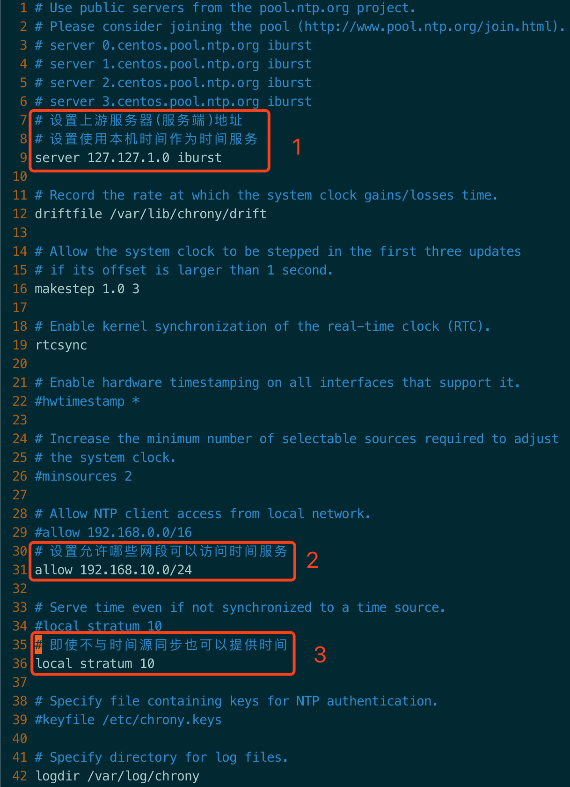
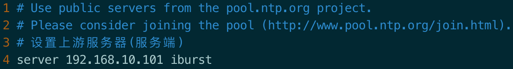
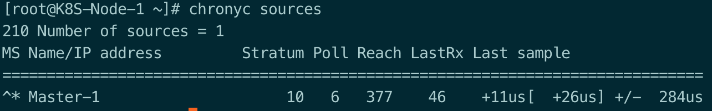
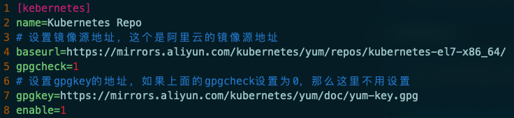
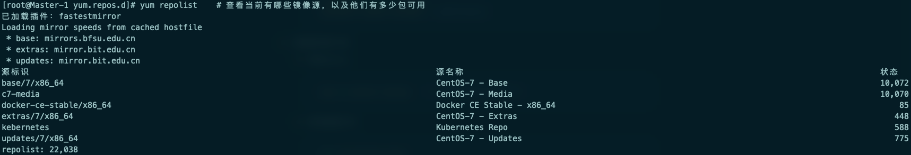
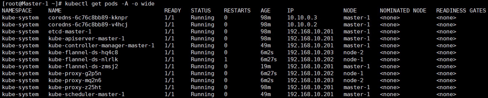

## K8S 部署

### 搭建一个完整的Kubernetes集群

1. 生产环境K8S平台规划
2. 服务器硬件配置推荐
3. 官方提供三种部署方式
4. 为Etcd和APIServer自签SSL证书
5. Etcd数据库集群部署
6. 部署Master组件
7. 部署Node组件
8. 部署K8S集群网络
9. 部署Web UI（Dashboard）
10. 部署集群内部DNS解析服务（CoreDNS）

### 官方提供的三种部署方式

- minikube：主要用来自己体验着玩
  - Minikube是一个工具，可以在本地快速运行一个单节点的Kubernetes，仅用于尝试Kubernetes
  - 部署地址：https://kubernetes.io/docs/setup/learning-environment/minikube/
- kubeadm：安装方式相对比较简单，但是不知道中途都配置了哪些东西，不利于学习
  - Kubeadm也是工具，提供kubeadm init和kubeadm join，用于快速部署Kubernetes集群。
  - 部署地址：https://kubernetes.io/docs/reference/setup-tools/kubeadm/kubeadm
- 二进制：安装方式相对困难，但是这个更适合用在生产环境上
  - 推荐，从官方下载发行版的二进制包，手动部署每个组件，组成Kubernetes集群。
  - 下载地址：https://github.com/kubernetes/kubernetes/releases

### 安装-初始化节点

- 关闭防火墙

  ```shell
  $ systemctl stop firewalld 			# 停止防火墙服务
  $ systemctl disable firewalld		# 关闭防火墙开机启动
  $ iptables -F										# 清除iptables规则
  ```

- 关闭seLinux

  ```shell
  $ setenforce 0								# 临时关闭selinux
  $ vim /etc/selinux/config 		# 永久关闭修改配置selinux文件
  ```

- 关闭swap

  ```shell
  $ swapoff -a				# 临时关闭swap
  $ vim /etc/fstab		# 修改配置文件，永久关闭swap
  ```

- 配置节点主机名（单节点环境）

  ```shell
  $ hostnamectl set-hostname Master-1		# 通过命令行修改配置文件
  $ vim /etc/hostname										# 修改配置文件
  ```

- 配置名称解析（修改hosts文件）

  ```shell
  $ vim /etc/hosts
  ```

- 配置时间同步

  - 选择一个服务器作为服务端

    - 安装时间服务

      ```shell
      yum -y install chrony			# 一般默认都是已经安装了的
      ```

    - 修改配置文件

      ```shell
      vim /etc/chrony.conf
      ```

      

    - 重新启动服务

      ```shell
      systemctl restart chronyd
      systemctl enable chronyd 	# 设置开启自启动
      ```

  - 设置服务客户端

    - 安装chrony

      ```shell
      yum -y install chrony			# 一般默认都是已经安装了的
      ```

    - 修改配置文件

      ```shell
      vim /etc/chrony.conf
      ```

      

    - 重启服务

      ```shell
      systemctl restart chronyd
      systemctl enable chronyd 	# 设置开启自启动
      ```

    - 检查时间是否已同步

      ```shell
      chronyc sources
      ```

      

      最后一行的 Master-1 代表的是服务端机器的主机名，主机名前面如果是 `^*` 的话代表同步的没问题，如果是 `^? ` 代表时间还没同步，如果等一会时间还没同步，可能配置的有问题。

### 安装-开始部署K8S

1. 准备工作：

   1. 检查服务器之间时间是否同步，确保所有服务器的时间可以通过时间同步服务器同步

   2. 配置服务器之间域名解析，数量少可使用修改 hosts 文件的方式实现

   3. 关闭swap、selinux和(iptables/firewalld)

   4. 配置docker yum源

      ```shell
      cd /etc/yum.repos.d
      
      wget https://mirrors.aliyun.com/docker-ce/linux/centos/docker-ce.repo
      ```

   5. 配置kubernetes yum源

      1. 添加将镜像源

         ```shell
         cd /etc/yum.repos.d
         
         vim kubernetes.repo
         ```

         

      2. 导入gpgkey

         ```shell
         rpm --import https://mirrors.aliyun.com/kubernetes/yum/doc/yum-key.gpg
         # 安装kebelet需要导入下面这个gpgkey
         rpm --import https://mirrors.aliyun.com/kubernetes/yum/doc/rpm-package-key.gpg
         ```

   6. 检查镜像源是否生效以及镜像源中是否有可用包（最后面的状态参数代表镜像源里面的包）

      

2. Master, Nodes: 安装并启动kubelet、kubectl、kubeadm、docker-ce、

   1. 安装

      ```shell
      yum -y install docker-ce kubelet kubeadm kubectl
      ```

   2. docker

      - 修改 Cgroup Driver

        需要将Docker 的 Cgroup Driver 修改为 systemd，不然在为Kubernetes 集群添加节点时会报如下错误：

        ```shell
        # 执行 kubeadm join 的 WARNING 信息
        [WARNING IsDockerSystemdCheck]: detected "cgroupfs" as the Docker cgroup driver. The recommended driver is "systemd". Please follow the guide at https://kubernetes.io/docs/setup/cri/
        ```

        目前 Docker 的 Cgroup Driver 看起来应该是这样的：

        ```shell
        docker info|grep "Cgroup Driver"
          Cgroup Driver: cgroupfs
        ```

        需要将这个值修改为 systemd ，同时我将registry替换成国内的一些仓库地址，以免直接在官方仓库拉取镜像会很慢，操作如下。

        ```shell
        cat > /etc/docker/daemon.json <<EOF
        {
            "exec-opts": ["native.cgroupdriver=systemd"],
            "log-driver": "json-file",
            "log-opts": {
            "max-size": "100m"
            },
            "storage-driver": "overlay2",
            "registry-mirrors":[
                "https://kfwkfulq.mirror.aliyuncs.com",
                "https://2lqq34jg.mirror.aliyuncs.com",
                "https://pee6w651.mirror.aliyuncs.com",
                "http://hub-mirror.c.163.com",
                "https://docker.mirrors.ustc.edu.cn",
                "https://registry.docker-cn.com"
            ]
        }
        EOF
        
        mkdir -p /etc/systemd/system/docker.service.d
        ```

      - 启动docker

        ```shell
        # 启动docker
        systemctl start docker
        
        # 开机自启
        systemctl enable docker
        ```

   3. kubeadm

      - 初始化kubeadm

        ```shell
        [root@Master-1 yum.repos.d]# kubeadm init \
        # 指定版本号
        > --kubernetes-version=1.19.4 \
        # 指定镜像仓库，这里是添加了一个国内的镜像仓库
        > --image-repository registry.cn-hangzhou.aliyuncs.com/google_containers \
        # 设置pod的IP地址范围
        > --pod-network-cidr 10.10.0.0/16 \
        # 设置Service的VIP地址范围
        > --service-cidr 10.20.0.0/16
        ```

   4. kubelet

      - 查看安装kubelet生成了哪些文件

        ```shell
        rpm -ql kubelet
        ```

      - 如果swap必须要开，在 /etc/sysconfig/kubelet 文件中添加相应配置

        ```shell
        KUBELET_EXTRA_ARGS="--fail-swap-on=false"
        
        # 并在使用kubeadm初始化的时候 添加 --ignore-preflight-errors=Swap
        ```

      - 启动kubelet

        ```shell
        # 启动kubelet
        systemctl start kubelet
        
        # 开机自启动
        systemctl enable kubelet
        ```

   5. 检查Kubernetes节点状态 

      - 查看组件状态

        `````shell
        [root@Master-1 manifests]# kubectl get cs
        Warning: v1 ComponentStatus is deprecated in v1.19+
        NAME                 STATUS    MESSAGE             ERROR
        scheduler            Healthy   ok                  
        controller-manager   Healthy   ok                  
        etcd-0               Healthy   {"health":"true"}
        `````

      - 查看节点状态

        ```shell
        [root@Master-1 manifests]# kubectl get nodes
        NAME       STATUS     ROLES    AGE   VERSION
        master-1   NotReady   master   67m   v1.19.4
        ```

        可以发现状态是 `NotReady` ，也有是因为还没安装网络组件

      - 安装网络组件，只需要在 Master 节点上安装

        网络组件有：flannel、Calico，二选一

        ```shell
        # 安装flannel
        kubectl apply -f https://raw.githubusercontent.com/coreos/flannel/master/Documentation/kube-flannel.yml
        ```

        ```shell
        # 安装 Calico
        # 获取配置文件
        mkdir calico && cd calico
        wget https://docs.projectcalico.org/v3.8/manifests/calico.yaml
        
        # 修改配置文件
        # 找到 625 行左右的 192.168.0.0/16 ，并修改为我们初始化时配置的 10.10.0.0/16
        vim calico.yaml
        
        # 部署 Pod 网络组件
        kubectl apply -f calico.yaml
        ```

        查看节点状态

        ```shell
        [root@Master-1 ~]# kubectl get nodes
        NAME       STATUS   ROLES    AGE   VERSION
        master-1   Ready    master   82m   v1.19.4
        ```

      - 查看pod状态

        ```shell
        [root@Master-1 ~]# kubectl get pods -n kube-system
        NAME                               READY   STATUS    RESTARTS   AGE
        coredns-6c76c8bb89-kknpr           1/1     Running   0          84m
        coredns-6c76c8bb89-v4hcj           1/1     Running   0          84m
        etcd-master-1                      1/1     Running   0          84m
        kube-apiserver-master-1            1/1     Running   0          84m
        kube-controller-manager-master-1   1/1     Running   0          35m
        kube-flannel-ds-zmsj2              1/1     Running   0          6m7s
        kube-proxy-z25ht                   1/1     Running   0          84m
        kube-scheduler-master-1            1/1     Running   0          35m
        ```

        参数：

        -n  :  指定命名空间

        ​	kube-system是Kubernetes系统创建的对象的命名空间，系统级的pod都在这个命名空间中

        -o  :  指定显示格式

        ​	wide 是 显示pod的详细信息

        -A  :  代表显示所有命名空间中的pods

        

      - 查看系统有哪些命名空间

        ```shell
        [root@Master-1 ~]# kubectl get ns
        NAME              STATUS   AGE
        default           Active   87m
        kube-node-lease   Active   87m
        kube-public       Active   87m
        kube-system       Active   87m
        ```

3. Master：kubeadm init     # 初始化集群

4. Nodes：kubeadm join     # 加入集群

   ```shell
   kubeadm join 192.168.10.201:6443 --token 34gosg.jo0ekn5mna56rypy \
       --discovery-token-ca-cert-hash sha256:cf33af10b85400f64643cde0b6282e46f99b830cc5b82072d5ed9bebadea40e8
   ```

   