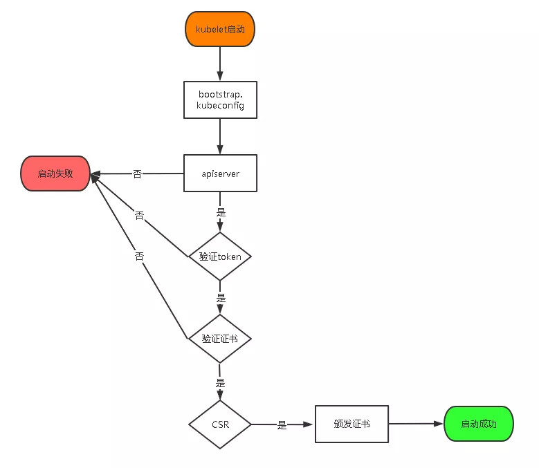

## 实验环境

| 服务器名 | IP             | 系统       | Docker | Kubernetes |
| -------- | -------------- | ---------- | ------ | ---------- |
| Master-1 | 192.168.10.201 | CentOS 7.7 | 19-ce  | 1.18.3     |
| Node-1   | 192.168.10.221 | CentOS 7.7 | 19-ce  | 1.18.3     |
| Node-2   | 192.168.10.222 | CentOS 7.7 | 19-ce  | 1.18.3     |

### 整体规划

| 服务器名 | 组件                                                         |
| -------- | ------------------------------------------------------------ |
| Master-1 | kube-apiserver，kube-controller-manager，kube-scheduler，docker，etcd |
| Node-1   | kubelet，kube-proxy，docker，etcd                            |
| Node-2   | kubelet，kube-proxy，docker，etcd                            |


## 安装要求

- 一台或多台机器，操作系统 CentOS7.x-86_x64
- 硬件配置：2GB或更多RAM，2个CPU或更多CPU，硬盘30GB或更多
- 集群中所有机器之间网络互通
- 可以访问外网，需要拉取镜像，如果服务器不能上网，需要提前下载镜像并导入节点
- 禁止swap分区


## 操作系统初始化配置

```shell
# 关闭防火墙
systemctl stop firewalld
systemctl disable firewalld

# 关闭selinux
sed -i 's/enforcing/disabled/' /etc/selinux/config  # 永久
setenforce 0  # 临时

# 关闭swap
swapoff -a  # 临时
sed -ri 's/.*swap.*/#&/' /etc/fstab    # 永久

# 根据规划设置主机名
hostnamectl set-hostname <hostname>

# 在master添加hosts
cat >> /etc/hosts << EOF
192.168.10.201 Master-1 master-1
192.168.10.221 Node-1 node-1
192.168.10.222 Node-2 node-2
EOF

# 时间同步, 除了ntp也可以用chrony
yum install ntpdate -y
ntpdate time.windows.com
```


## 开始安装


### 1. 准备 `cfssl` 证书生成工具，在 "Master" 节点上操作

```shell
wget https://pkg.cfssl.org/R1.2/cfssl_linux-amd64
wget https://pkg.cfssl.org/R1.2/cfssljson_linux-amd64
wget https://pkg.cfssl.org/R1.2/cfssl-certinfo_linux-amd64

chmod +x cfssl_linux-amd64 cfssljson_linux-amd64 cfssl-certinfo_linux-amd64

mv cfssl_linux-amd64 /usr/local/bin/cfssl
mv cfssljson_linux-amd64 /usr/local/bin/cfssljson
mv cfssl-certinfo_linux-amd64 /usr/bin/cfssl-certinfo
```

### 2. 创建工作目录

```shell
mkdir -p ~/tls/{etcd,k8s}
```

### 3.1 创建 `Etcd` 证书

- 进入工作目录

  ```shell
  # 进入工作目录
  cd ~/tls/etcd
  ```

- 自签CA

  ```shell
  cat > ca-config.json << EOF
  {
    "signing": {
      "default": {
        "expiry": "87600h"
      },
      "profiles": {
        "www": {
           "expiry": "87600h",
           "usages": [
              "signing",
              "key encipherment",
              "server auth",
              "client auth"
          ]
        }
      }
    }
  }
  EOF
  
  cat > ca-csr.json << EOF
  {
      "CN": "etcd CA",
      "key": {
          "algo": "rsa",
          "size": 2048
      },
      "names": [
          {
              "C": "CN",
              "L": "Beijing",
              "ST": "Beijing"
          }
      ]
  }
  EOF
  ```
  
- 生成证书

  ```shell
  cfssl gencert -initca ca-csr.json | cfssljson -bare ca -
  
  ls *pem
  ca-key.pem  ca.pem
  ```

- #### 使用自签CA签发 `Etcd HTTPS` 证书

  ```shell
  cat > server-csr.json << EOF
  {
      "CN": "etcd",
      "hosts": [
      "192.168.10.201",
      "192.168.10.221",
      "192.168.10.222"
      ],
      "key": {
          "algo": "rsa",
          "size": 2048
      },
      "names": [
          {
              "C": "CN",
              "L": "BeiJing",
              "ST": "BeiJing"
          }
      ]
  }
  EOF
  
  # 注：上述文件hosts字段中IP为所有etcd节点的集群内部通信IP，一个都不能少！为了方便后期扩容可以多写几个预留的IP。
  ```

- 生成证书

  ```shell
  cfssl gencert -ca=ca.pem -ca-key=ca-key.pem -config=ca-config.json -profile=www server-csr.json | cfssljson -bare server
  
  ls *pem
  ca-key.pem  ca.pem  server-key.pem  server.pem
  ```

### 3.2 安装 `Etcd`

- 下载地址：

  https://github.com/etcd-io/etcd/releases/download/v3.4.9/etcd-v3.4.9-linux-amd64.tar.gz

- 在 Master-1 节点上操作，稍等可直接将所有文件拷贝到 Node 节点上

- 创建工作目录并解压二进制包

  ```shell
  mkdir /home/etcd/{bin,cfg,ssl,data} -p
  
  cd /home
  
  wget https://github.com/etcd-io/etcd/releases/download/v3.4.9/etcd-v3.4.9-linux-amd64.tar.gz
  
  tar xf etcd-v3.4.9-linux-amd64.tar.gz
  
  mv etcd-v3.4.9-linux-amd64/{etcd,etcdctl} /home/etcd/bin/
  
  rm -rf etcd-v3.4.9-linux-amd64*
  ```

- 创建 `Etcd` 配置文件

  ```shell
  cat > /home/etcd/cfg/etcd.conf << EOF
  #[Member]
  ETCD_NAME="etcd-1"
  ETCD_DATA_DIR="/home/etcd/data/default.etcd"
  ETCD_LISTEN_PEER_URLS="https://192.168.10.201:2380"
  ETCD_LISTEN_CLIENT_URLS="https://192.168.10.201:2379"
  #[Clustering]
  ETCD_INITIAL_ADVERTISE_PEER_URLS="https://192.168.10.201:2380"
  ETCD_ADVERTISE_CLIENT_URLS="https://192.168.10.201:2379"
  ETCD_INITIAL_CLUSTER="etcd-1=https://192.168.10.201:2380,etcd-2=https://192.168.10.221:2380,etcd-3=https://192.168.10.222:2380"
  ETCD_INITIAL_CLUSTER_TOKEN="etcd-cluster"
  ETCD_INITIAL_CLUSTER_STATE="new"
  EOF
  ```

  ```shell
  ETCD_NAME：节点名称，集群中唯一
  ETCD_DATA_DIR：数据目录
  ETCD_LISTEN_PEER_URLS：集群通信监听地址
  ETCD_LISTEN_CLIENT_URLS：客户端访问监听地址
  ETCD_INITIAL_ADVERTISE_PEER_URLS：集群通告地址
  ETCD_ADVERTISE_CLIENT_URLS：客户端通告地址
  ETCD_INITIAL_CLUSTER：集群节点地址
  ETCD_INITIAL_CLUSTER_TOKEN：集群Token
  ETCD_INITIAL_CLUSTER_STATE：加入集群的当前状态，new是新集群，existing表示加入已有集群
  ```

- #### systemd管理 `Etcd`

  ```shell
  cat > /usr/lib/systemd/system/etcd.service << EOF
  [Unit]
  Description=Etcd Server
  After=network.target
  After=network-online.target
  Wants=network-online.target
  [Service]
  Type=notify
  EnvironmentFile=/home/etcd/cfg/etcd.conf
  ExecStart=/home/etcd/bin/etcd \
  --cert-file=/home/etcd/ssl/server.pem \
  --key-file=/home/etcd/ssl/server-key.pem \
  --peer-cert-file=/home/etcd/ssl/server.pem \
  --peer-key-file=/home/etcd/ssl/server-key.pem \
  --trusted-ca-file=/home/etcd/ssl/ca.pem \
  --peer-trusted-ca-file=/home/etcd/ssl/ca.pem \
  --logger=zap
  Restart=on-failure
  LimitNOFILE=65536
  [Install]
  WantedBy=multi-user.target
  EOF
  ```

- 把刚才生成的证书拷贝到配置文件中指定的路径

  ```shell
  cp ~/tls/etcd/*pem /home/etcd/ssl/
  ```

- 将 `Etcd` 目录 和 `启动文件` 拷贝到的 Node 节点上

  ```shell
  scp -r /home/etcd root@node-1:/home
  scp -r /home/etcd root@node-2:/home
  
  scp /usr/lib/systemd/system/etcd.service root@node-1:/usr/lib/systemd/system/
  scp /usr/lib/systemd/system/etcd.service root@node-2:/usr/lib/systemd/system/
  ```

- 修改 Node 节点上 `Etcd` 的配置文件

  ```shell
  vi /home/etcd/cfg/etcd.conf
  #[Member]
  ETCD_NAME="etcd-1"   # 修改此处，node-1改为etcd-2，node-2改为etcd-3
  ETCD_DATA_DIR="/home/etcd/data/default.etcd"
  ETCD_LISTEN_PEER_URLS="https://192.168.10.201:2380"   # 修改此处为当前服务器IP
  ETCD_LISTEN_CLIENT_URLS="https://192.168.10.201:2379" # 修改此处为当前服务器IP
  
  #[Clustering]
  ETCD_INITIAL_ADVERTISE_PEER_URLS="https://192.168.10.201:2380" # 修改此处为当前服务器IP
  ETCD_ADVERTISE_CLIENT_URLS="https://192.168.10.201:2379" # 修改此处为当前服务器IP
  ETCD_INITIAL_CLUSTER="etcd-1=https://192.168.10.201:2380,etcd-2=https://192.168.10.221:2380,etcd-3=https://192.168.10.222:2380"
  ETCD_INITIAL_CLUSTER_TOKEN="etcd-cluster"
  ETCD_INITIAL_CLUSTER_STATE="new"
  ```

- 启动并设置开机启动，注意：`Etcd` 集群要一起启动，分开启动可能会启动不起来

  ```shell
  systemctl daemon-reload
  systemctl start etcd
  systemctl enable etcd
  systemctl status etcd
  ```

- 查看集群状态

  ```shell
  ETCDCTL_API=3 /home/etcd/bin/etcdctl --cacert=/home/etcd/ssl/ca.pem --cert=/home/etcd/ssl/server.pem --key=/home/etcd/ssl/server-key.pem --endpoints="https://192.168.10.201:2379,https://192.168.10.221:2379,https://192.168.10.222:2379" endpoint health
  
  # 如果输出下面信息，说明集群部署成功，如有问题，第一步查看日志 /var/log/message 或 journalctl -fu etcd
  https://192.168.10.201:2379 is healthy: successfully committed proposal: took = 9.666709ms
  https://192.168.10.221:2379 is healthy: successfully committed proposal: took = 10.138476ms
  https://192.168.10.222:2379 is healthy: successfully committed proposal: took = 10.784285ms
  ```

### 4. 安装 `Docker`

- 下载地址：

  https://download.docker.com/linux/static/stable/x86_64/docker-19.03.9.tgz

- 以下在所有节点操作。这里采用二进制安装，用yum安装也一样。

- 解压二进制包

  ```shell
  wget https://download.docker.com/linux/static/stable/x86_64/docker-19.03.9.tgz
  
  tar zxvf docker-19.03.9.tgz
  mv docker/* /usr/bin
  
  rm -rf docker*
  ```

- systemd 管理 `Docker`

  ```shell
  cat > /usr/lib/systemd/system/docker.service << EOF
  [Unit]
  Description=Docker Application Container Engine
  Documentation=https://docs.docker.com
  After=network-online.target firewalld.service
  Wants=network-online.target
  [Service]
  Type=notify
  ExecStart=/usr/bin/dockerd
  ExecReload=/bin/kill -s HUP $MAINPID
  LimitNOFILE=infinity
  LimitNPROC=infinity
  LimitCORE=infinity
  TimeoutStartSec=0
  Delegate=yes
  KillMode=process
  Restart=on-failure
  StartLimitBurst=3
  StartLimitInterval=60s
  [Install]
  WantedBy=multi-user.target
  EOF
  ```

- 创建配置文件

  ```shell
  mkdir /etc/docker
  cat > /etc/docker/daemon.json << EOF
  {
    "registry-mirrors": ["https://b9pmyelo.mirror.aliyuncs.com"]
  }
  EOF
  
  # registry-mirrors 阿里云镜像加速器
  ```

- 启动并设置开启启动

  ```shell
  systemctl daemon-reload
  systemctl start docker
  systemctl status docker
  systemctl enable docker
  ```

### 5. 部署 Master 节点

- 下面网址有很多版本可以下载

  https://github.com/kubernetes/kubernetes/blob/v1.18.4/CHANGELOG/CHANGELOG-1.18.md

- 下载地址：

  https://dl.k8s.io/v1.18.2/kubernetes-server-linux-amd64.tar.gz

### 5.1 部署 `kube-apiserver`

- 进入工作目录

  ```shell
  cd ~/tls/k8s
  ```

- 自签CA

  ```shell
  cat > ca-config.json << EOF
  {
    "signing": {
      "default": {
        "expiry": "87600h"
      },
      "profiles": {
        "kubernetes": {
           "expiry": "87600h",
           "usages": [
              "signing",
              "key encipherment",
              "server auth",
              "client auth"
          ]
        }
      }
    }
  }
  EOF
  cat > ca-csr.json << EOF
  {
      "CN": "kubernetes",
      "key": {
          "algo": "rsa",
          "size": 2048
      },
      "names": [
          {
              "C": "CN",
              "L": "Beijing",
              "ST": "Beijing",
              "O": "k8s",
              "OU": "System"
          }
      ]
  }
  EOF
  ```

- 生成证书

  ```shell
  cfssl gencert -initca ca-csr.json | cfssljson -bare ca -
  
  ls *pem
  ca-key.pem  ca.pem
  ```

- 使用自签CA签发 `kube-apiserver` HTTPS证书，创建证书申请文件

  ```shell
  cat > server-csr.json << EOF
  {
      "CN": "kubernetes",
      "hosts": [
        "10.0.0.1",
        "127.0.0.1",
        "192.168.10.201",
        "192.168.10.202",
        "192.168.10.203",
        "192.168.10.211",
        "192.168.10.212",
        "192.168.10.221",
        "192.168.10.222",
        "192.168.10.223",
        "192.168.10.224",
        "kubernetes",
        "kubernetes.default",
        "kubernetes.default.svc",
        "kubernetes.default.svc.cluster",
        "kubernetes.default.svc.cluster.local"
      ],
      "key": {
          "algo": "rsa",
          "size": 2048
      },
      "names": [
          {
              "C": "CN",
              "L": "BeiJing",
              "ST": "BeiJing",
              "O": "k8s",
              "OU": "System"
          }
      ]
  }
  EOF
  
  # 注：上述文件hosts字段中IP为所有Master/LB/VIP IP，一个都不能少！为了方便后期扩容可以多写几个预留的IP。
  ```

- 生成证书

  ```shell
  cfssl gencert -ca=ca.pem -ca-key=ca-key.pem -config=ca-config.json -profile=kubernetes server-csr.json | cfssljson -bare server
  
  ls *pem
  ca-key.pem  ca.pem  server-key.pem  server.pem
  ```

- 下载并解压二进制包

  ```shell
  cd /root
  
  wget https://dl.k8s.io/v1.18.2/kubernetes-server-linux-amd64.tar.gz
  
  tar xf kubernetes-server-linux-amd64.tar.gz
  
  mkdir -p /home/kubernetes/{bin,cfg,ssl,logs}
  
  cd kubernetes/server/bin
  
  cp kube-apiserver kube-scheduler kube-controller-manager /home/kubernetes/bin
  
  cp kubectl /usr/bin/
  ```

- 创建 `kube-apiserver` 配置文件

  ```shell
  cat > /home/kubernetes/cfg/kube-apiserver.conf << EOF
  KUBE_APISERVER_OPTS="--logtostderr=false \\
  --v=2 \\
  --log-dir=/home/kubernetes/logs \\
  --etcd-servers=https://192.168.10.201:2379,https://192.168.10.221:2379,https://192.168.10.222:2379 \\
  --bind-address=192.168.10.201 \\
  --secure-port=6443 \\
  --advertise-address=192.168.10.201 \\
  --allow-privileged=true \\
  --service-cluster-ip-range=10.0.0.0/24 \\
  --enable-admission-plugins=NamespaceLifecycle,LimitRanger,ServiceAccount,ResourceQuota,NodeRestriction \\
  --authorization-mode=RBAC,Node \\
  --enable-bootstrap-token-auth=true \\
  --token-auth-file=/home/kubernetes/cfg/token.csv \\
  --service-node-port-range=30000-32767 \\
  --kubelet-client-certificate=/home/kubernetes/ssl/server.pem \\
  --kubelet-client-key=/home/kubernetes/ssl/server-key.pem \\
  --tls-cert-file=/home/kubernetes/ssl/server.pem  \\
  --tls-private-key-file=/home/kubernetes/ssl/server-key.pem \\
  --client-ca-file=/home/kubernetes/ssl/ca.pem \\
  --service-account-key-file=/home/kubernetes/ssl/ca-key.pem \\
  --etcd-cafile=/home/etcd/ssl/ca.pem \\
  --etcd-certfile=/home/etcd/ssl/server.pem \\
  --etcd-keyfile=/home/etcd/ssl/server-key.pem \\
  --audit-log-maxage=30 \\
  --audit-log-maxbackup=3 \\
  --audit-log-maxsize=100 \\
  --audit-log-path=/home/kubernetes/logs/k8s-audit.log"
  EOF
  
  # 注：上面两个\ \ 第一个是转义符，第二个是换行符，使用转义符是为了使用EOF保留换行符。
  ```

  ```shell
  --logtostderr：启用日志
  --v：日志等级
  --log-dir：日志目录
  --etcd-servers：etcd集群地址
  --bind-address：监听地址
  --secure-port：https安全端口
  --advertise-address：集群通告地址
  --allow-privileged：启用授权
  --service-cluster-ip-range：Service虚拟IP地址段
  --enable-admission-plugins：准入控制模块
  --authorization-mode：认证授权，启用RBAC授权和节点自管理
  --enable-bootstrap-token-auth：启用TLS bootstrap机制
  --token-auth-file：bootstrap token文件
  --service-node-port-range：Service nodeport类型默认分配端口范围
  --kubelet-client-xxx：apiserver访问kubelet客户端证书
  --tls-xxx-file：apiserver https证书
  --etcd-xxxfile：连接Etcd集群证书
  --audit-log-xxx：审计日志
  ```

- 把刚才生成的证书拷贝到配置文件中指定的路径

  ```shell
  cp ~/tls/k8s/{ca,server}*pem /home/kubernetes/ssl/
  ```

- 启动 TLS Bootstrapping 机制

  TLS Bootstraping：Master apiserver启用TLS认证后，Node节点kubelet和kube-proxy要与kube-apiserver进行通信，必须使用CA签发的有效证书才可以，当Node节点很多时，这种客户端证书颁发需要大量工作，同样也会增加集群扩展复杂度。为了简化流程，Kubernetes引入了TLS bootstraping机制来自动颁发客户端证书，kubelet会以一个低权限用户自动向apiserver申请证书，kubelet的证书由apiserver动态签署。所以强烈建议在Node上使用这种方式，目前主要用于kubelet，kube-proxy还是由我们统一颁发一个证书。

  TLS bootstraping 工作流程：

  

- 创建上述配置文件中 token 文件

  ```shell
  # 格式：token，用户名，UID，用户组
  cat > /home/kubernetes/cfg/token.csv << EOF
  c47ffb939f5ca36231d9e3121a252940,kubelet-bootstrap,10001,"system:node-bootstrapper"
  EOF
  
  # token也可自行生成替换：
  head -c 16 /dev/urandom | od -An -t x | tr -d ' '
  ```

- systemd管理 `kube-apiserver`

  ```shell
  cat > /usr/lib/systemd/system/kube-apiserver.service << EOF
  [Unit]
  Description=Kubernetes API Server
  Documentation=https://github.com/kubernetes/kubernetes
  [Service]
  EnvironmentFile=/home/kubernetes/cfg/kube-apiserver.conf
  ExecStart=/home/kubernetes/bin/kube-apiserver \$KUBE_APISERVER_OPTS
  Restart=on-failure
  [Install]
  WantedBy=multi-user.target
  EOF
  ```

- 启动并设置开机启动

  ```shell
  systemctl daemon-reload
  systemctl start kube-apiserver
  systemctl enable kube-apiserver
  systemctl status kube-apiserver
  ```

- 授权 `kubelet-bootstrap` 用户允许请求证书

  ```shell
  kubectl create clusterrolebinding kubelet-bootstrap \
  --clusterrole=system:node-bootstrapper \
  --user=kubelet-bootstrap
  ```

### 5.2 部署 `kube-controller-manager`

- 创建配置文件

  ```shell
  cat > /home/kubernetes/cfg/kube-controller-manager.conf << EOF
  KUBE_CONTROLLER_MANAGER_OPTS="--logtostderr=false \\
  --v=2 \\
  --log-dir=/home/kubernetes/logs \\
  --leader-elect=true \\
  --master=127.0.0.1:8080 \\
  --bind-address=127.0.0.1 \\
  --allocate-node-cidrs=true \\
  --cluster-cidr=10.244.0.0/16 \\
  --service-cluster-ip-range=10.0.0.0/24 \\
  --cluster-signing-cert-file=/home/kubernetes/ssl/ca.pem \\
  --cluster-signing-key-file=/home/kubernetes/ssl/ca-key.pem  \\
  --root-ca-file=/home/kubernetes/ssl/ca.pem \\
  --service-account-private-key-file=/home/kubernetes/ssl/ca-key.pem \\
  --experimental-cluster-signing-duration=87600h0m0s"
  EOF
  ```

  ```shell
  --master：通过本地非安全本地端口8080连接apiserver。
  --leader-elect：当该组件启动多个时，自动选举（HA）
  --cluster-signing-cert-file/–cluster-signing-key-file：自动为kubelet颁发证书的CA，与apiserver保持一致
  ```

- system 管理 `controller-manager`

  ```shell
  cat > /usr/lib/systemd/system/kube-controller-manager.service << EOF
  [Unit]
  Description=Kubernetes Controller Manager
  Documentation=https://github.com/kubernetes/kubernetes
  [Service]
  EnvironmentFile=/home/kubernetes/cfg/kube-controller-manager.conf
  ExecStart=/home/kubernetes/bin/kube-controller-manager \$KUBE_CONTROLLER_MANAGER_OPTS
  Restart=on-failure
  [Install]
  WantedBy=multi-user.target
  EOF
  ```

- 启动并设置开机启动

  ```shell
  systemctl daemon-reload
  systemctl start kube-controller-manager
  systemctl enable kube-controller-manager
  systemctl status kube-controller-manager
  ```

### 5.3 部署 `kube-scheduler`

- 创建配置文件

  ```shell
  cat > /home/kubernetes/cfg/kube-scheduler.conf << EOF
  KUBE_SCHEDULER_OPTS="--logtostderr=false \
  --v=2 \
  --log-dir=/home/kubernetes/logs \
  --leader-elect \
  --master=127.0.0.1:8080 \
  --bind-address=127.0.0.1"
  EOF
  ```

  ```shell
  --master：通过本地非安全本地端口8080连接apiserver。
  --leader-elect：当该组件启动多个时，自动选举（HA）
  ```

- systemd管理 `scheduler`

  ```shell
  cat > /usr/lib/systemd/system/kube-scheduler.service << EOF
  [Unit]
  Description=Kubernetes Scheduler
  Documentation=https://github.com/kubernetes/kubernetes
  [Service]
  EnvironmentFile=/home/kubernetes/cfg/kube-scheduler.conf
  ExecStart=/home/kubernetes/bin/kube-scheduler \$KUBE_SCHEDULER_OPTS
  Restart=on-failure
  [Install]
  WantedBy=multi-user.target
  EOF
  ```

- 启动并设置开机启动

  ```shell
  systemctl daemon-reload
  systemctl start kube-scheduler
  systemctl enable kube-scheduler
  systemctl status kube-scheduler
  ```

- 查看集群状态

  ```shell
  # 所有组件都已经启动成功，通过kubectl工具查看当前集群组件状态：
  
  [root@Master-1 ~]# kubectl get cs
  NAME                 STATUS    MESSAGE             ERROR
  scheduler            Healthy   ok
  controller-manager   Healthy   ok
  etcd-1               Healthy   {"health":"true"}
  etcd-0               Healthy   {"health":"true"}
  etcd-2               Healthy   {"health":"true"}
  
  # 如上输出说明Master节点组件运行正常。
  ```

### 5.4 部署 `CoreDNS`

- CoreDNS用于集群内部Service名称解析

  ```shell
  kubectl apply -f coredns.yaml
  
  kubectl get pods -n kube-system 
  NAME                          READY   STATUS    RESTARTS   AGE
  coredns-5ffbfd976d-j6shb      1/1     Running   0          32s
  kube-flannel-ds-amd64-2pc95   1/1     Running   0          38m
  ```

- DNS解析测试

  ```shell
  kubectl run -it --rm dns-test --image=busybox:1.28.4 sh
  If you don't see a command prompt, try pressing enter.
  
  / # nslookup kubernetes
  Server:    10.0.0.2
  Address 1: 10.0.0.2 kube-dns.kube-system.svc.cluster.local
  
  Name:      kubernetes
  Address 1: 10.0.0.1 kubernetes.default.svc.cluster.local
  
  # 解析没问题
  ```

### 6. 部署 Worker Node

- 下面还是在Master上操作，即Master同时作为Worker Node

### 6.1 创建工作目录并拷贝二进制文件

- 创建工作目录

  ```shell
  mkdir -p /home/kubernetes/{bin,cfg,ssl,logs} 
  ```

- 拷贝二进制文件

  ```shell
  cd /root/kubernetes/server/bin
  cp kubelet kube-proxy /home/kubernetes/bin
  ```

### 6.2 部署 `kubelet`

- 创建配置文件

  ```shell
  cat > /home/kubernetes/cfg/kubelet.conf << EOF
  KUBELET_OPTS="--logtostderr=false \\
  --v=2 \\
  --log-dir=/home/kubernetes/logs \\
  --hostname-override=Master-1 \\	# 这里要设置成当前计算机的主机名
  --network-plugin=cni \\
  --kubeconfig=/home/kubernetes/cfg/kubelet.kubeconfig \\
  --bootstrap-kubeconfig=/home/kubernetes/cfg/bootstrap.kubeconfig \\
  --config=/home/kubernetes/cfg/kubelet-config.yml \\
  --cert-dir=/home/kubernetes/ssl \\
  --pod-infra-container-image=lizhenliang/pause-amd64:3.0"
  EOF
  ```

  ```shell
  --hostname-override：显示名称，集群中唯一
  --network-plugin：启用CNI
  --kubeconfig：空路径，会自动生成，后面用于连接apiserver
  --bootstrap-kubeconfig：首次启动向apiserver申请证书
  --config：配置参数文件
  --cert-dir：kubelet证书生成目录
  --pod-infra-container-image：管理Pod网络容器的镜像
  ```

- 配置参数文件

  ```shell
  cat > /home/kubernetes/cfg/kubelet-config.yml << EOF
  kind: KubeletConfiguration
  apiVersion: kubelet.config.k8s.io/v1beta1
  address: 0.0.0.0
  port: 10250
  readOnlyPort: 10255
  cgroupDriver: cgroupfs
  clusterDNS:
  - 10.0.0.2
  clusterDomain: cluster.local 
  failSwapOn: false
  authentication:
    anonymous:
      enabled: false
    webhook:
      cacheTTL: 2m0s
      enabled: true
    x509:
      clientCAFile: /home/kubernetes/ssl/ca.pem 
  authorization:
    mode: Webhook
    webhook:
      cacheAuthorizedTTL: 5m0s
      cacheUnauthorizedTTL: 30s
  evictionHard:
    imagefs.available: 15%
    memory.available: 100Mi
    nodefs.available: 10%
    nodefs.inodesFree: 5%
  maxOpenFiles: 1000000
  maxPods: 110
  EOF
  ```

- 生成bootstrap.kubeconfig文件

  ```shell
  KUBE_APISERVER="https://192.168.10.201:6443" # apiserver IP:PORT
  TOKEN="c47ffb939f5ca36231d9e3121a252940" # 与token.csv里保持一致
  
  # 生成 kubelet bootstrap kubeconfig 配置文件
  kubectl config set-cluster kubernetes \
    --certificate-authority=/home/kubernetes/ssl/ca.pem \
    --embed-certs=true \
    --server=${KUBE_APISERVER} \
    --kubeconfig=bootstrap.kubeconfig
  kubectl config set-credentials "kubelet-bootstrap" \
    --token=${TOKEN} \
    --kubeconfig=bootstrap.kubeconfig
  kubectl config set-context default \
    --cluster=kubernetes \
    --user="kubelet-bootstrap" \
    --kubeconfig=bootstrap.kubeconfig
  kubectl config use-context default --kubeconfig=bootstrap.kubeconfig
  ```

- 拷贝到配置文件路径

  ```shell
  cp bootstrap.kubeconfig /home/kubernetes/cfg
  ```

- systemd管理 `kubelet`

  ```shell
  cat > /usr/lib/systemd/system/kubelet.service << EOF
  [Unit]
  Description=Kubernetes Kubelet
  After=docker.service
  [Service]
  EnvironmentFile=/home/kubernetes/cfg/kubelet.conf
  ExecStart=/home/kubernetes/bin/kubelet \$KUBELET_OPTS
  Restart=on-failure
  LimitNOFILE=65536
  [Install]
  WantedBy=multi-user.target
  EOF
  ```

- 启动并设置开机启动

  ```shell
  systemctl daemon-reload
  systemctl start kubelet
  systemctl enable kubelet
  systemctl status kubelet
  ```

### 6.3 批准 `kubelet` 证书申请并加入集群

 ```shell
# 查看kubelet证书请求
[root@Master-1 ~]# kubectl get csr
NAME                                                   AGE   SIGNERNAME                                    REQUESTOR           CONDITION
node-csr-1uV5KD279YR0hYa-jYrbvbO3s8nVi4UGed-pdH1f8N8   58s   kubernetes.io/kube-apiserver-client-kubelet   kubelet-bootstrap   Pending

# 批准申请
kubectl certificate approve node-csr-1uV5KD279YR0hYa-jYrbvbO3s8nVi4UGed-pdH1f8N8

# 查看节点
kubectl get node
NAME         STATUS     ROLES    AGE   VERSION
master-1     NotReady   <none>   7s    v1.18.3
# 注：由于网络插件还没有部署，节点会没有准备就绪 NotReady
 ```

### 6.4 部署 `kube-proxy`

- 创建配置文件

  ```shell
  cat > /home/kubernetes/cfg/kube-proxy.conf << EOF
  KUBE_PROXY_OPTS="--logtostderr=false \\
  --v=2 \\
  --log-dir=/home/kubernetes/logs \\
  --config=/home/kubernetes/cfg/kube-proxy-config.yml"
  EOF
  ```

- 配置参数文件

  ```shell
  cat > /home/kubernetes/cfg/kube-proxy-config.yml << EOF
  kind: KubeProxyConfiguration
  apiVersion: kubeproxy.config.k8s.io/v1alpha1
  bindAddress: 0.0.0.0
  metricsBindAddress: 0.0.0.0:10249
  clientConnection:
    kubeconfig: /home/kubernetes/cfg/kube-proxy.kubeconfig
  hostnameOverride: Master-1 # 注意这里要设置成当前节点的主机名
  clusterCIDR: 10.0.0.0/24
  EOF
  ```

- 生成 `kube-proxy` 证书

  ```shell
  # 切换工作目录
  cd ~/tls/k8s
  
  # 创建证书请求文件
  cat > kube-proxy-csr.json << EOF
  {
    "CN": "system:kube-proxy",
    "hosts": [],
    "key": {
      "algo": "rsa",
      "size": 2048
    },
    "names": [
      {
        "C": "CN",
        "L": "BeiJing",
        "ST": "BeiJing",
        "O": "k8s",
        "OU": "System"
      }
    ]
  }
  EOF
  
  # 生成证书
  cfssl gencert -ca=ca.pem -ca-key=ca-key.pem -config=ca-config.json -profile=kubernetes kube-proxy-csr.json | cfssljson -bare kube-proxy
  
  ls kube-proxy*pem
  kube-proxy-key.pem  kube-proxy.pem
  ```

- 生成kubeconfig文件

  ```shell
  KUBE_APISERVER="https://192.168.10.201:6443"
  
  kubectl config set-cluster kubernetes \
    --certificate-authority=/home/kubernetes/ssl/ca.pem \
    --embed-certs=true \
    --server=${KUBE_APISERVER} \
    --kubeconfig=kube-proxy.kubeconfig
  kubectl config set-credentials kube-proxy \
    --client-certificate=/root/tls/k8s/kube-proxy.pem \
    --client-key=/root/tls/k8s/kube-proxy-key.pem \
    --embed-certs=true \
    --kubeconfig=kube-proxy.kubeconfig
  kubectl config set-context default \
    --cluster=kubernetes \
    --user=kube-proxy \
    --kubeconfig=kube-proxy.kubeconfig
  kubectl config use-context default --kubeconfig=kube-proxy.kubeconfig
  ```

- 拷贝到配置文件中指定的路径

  ```shell
  cp kube-proxy.kubeconfig /home/kubernetes/cfg/
  ```

- systemd管理 `kube-proxy`

  ```shell
  cat > /usr/lib/systemd/system/kube-proxy.service << EOF
  [Unit]
  Description=Kubernetes Proxy
  After=network.target
  [Service]
  EnvironmentFile=/home/kubernetes/cfg/kube-proxy.conf
  ExecStart=/home/kubernetes/bin/kube-proxy \$KUBE_PROXY_OPTS
  Restart=on-failure
  LimitNOFILE=65536
  [Install]
  WantedBy=multi-user.target
  EOF
  ```

- 启动并设置开机启动

  ```shell
  systemctl daemon-reload
  systemctl start kube-proxy
  systemctl enable kube-proxy
  systemctl status kube-proxy
  ```

- 删除 Kubernetes 的安装包

  ```shell
  rm -rf /root/kubernetes
  rm -rf /root/kubernetes-server-linux-amd64.tar.gz
  ```

### 6.5 部署 `CNI` 网络

- 下载地址

  https://github.com/containernetworking/plugins/releases/download/v0.8.6/cni-plugins-linux-amd64-v0.8.6.tgz

- 下载解压二进制包并移动到默认工作目录

  ```shell
  # 注意，cni一定要放到opt目录下
  wget https://github.com/containernetworking/plugins/releases/download/v0.8.6/cni-plugins-linux-amd64-v0.8.6.tgz
  
  mkdir /opt/cni/bin
  
  tar zxvf cni-plugins-linux-amd64-v0.8.6.tgz -C /opt/cni/bin
  
  rm -rf cni-plugins-linux-amd64-v0.8.6.tgz
  ```

- 部署CNI网络

  ```shell
  mkdir /home/k8s-yaml
  cd /home/k8s-yaml
  wget https://raw.githubusercontent.com/coreos/flannel/master/Documentation/kube-flannel.yml
  # 默认镜像地址无法访问，修改为docker hub镜像仓库。
  sed -i -r "s#quay.io/coreos/flannel:.*-amd64#lizhenliang/flannel:v0.12.0-amd64#g" kube-flannel.yml
  
  kubectl apply -f kube-flannel.yml
  
  [root@Master-1 ~]# kubectl get pods -n kube-system
  NAME                          READY   STATUS    RESTARTS   AGE
  kube-flannel-ds-amd64-2pc95   1/1     Running   0          72s
  
  [root@Master-1 ~]# kubectl get node
  NAME         STATUS   ROLES    AGE   VERSION
  master-1     Ready    <none>   41m   v1.18.3
  # 部署好网络插件，Node准备就绪。
  ```

### 6.6 授权 `apiserver` 访问 `kubelet`

```shell
cd /home/k8s-yaml

cat > apiserver-to-kubelet-rbac.yaml << EOF
apiVersion: rbac.authorization.k8s.io/v1
kind: ClusterRole
metadata:
  annotations:
    rbac.authorization.kubernetes.io/autoupdate: "true"
  labels:
    kubernetes.io/bootstrapping: rbac-defaults
  name: system:kube-apiserver-to-kubelet
rules:
  - apiGroups:
      - ""
    resources:
      - nodes/proxy
      - nodes/stats
      - nodes/log
      - nodes/spec
      - nodes/metrics
      - pods/log
    verbs:
      - "*"
---
apiVersion: rbac.authorization.k8s.io/v1
kind: ClusterRoleBinding
metadata:
  name: system:kube-apiserver
  namespace: ""
roleRef:
  apiGroup: rbac.authorization.k8s.io
  kind: ClusterRole
  name: system:kube-apiserver-to-kubelet
subjects:
  - apiGroup: rbac.authorization.k8s.io
    kind: User
    name: kubernetes
EOF

kubectl apply -f apiserver-to-kubelet-rbac.yaml
```

### 7. 将在 `master` 节点生成的 `worker node` 相关文件拷贝到过去

- 以下在master节点操作

  ```shell
  mkdir -p /home/worker-node/{bin,cfg,logs,ssl}
  cd /home/
  
  cp /usr/bin/kubectl /home/work-node
  cp /usr/lib/systemd/system/{kubelet,kube-proxy}.service /home/worker-node
  cp -a /opt/cni /home/worker-node
  cp /home/kubernetes/bin/{kubelet,kube-proxy} /home/worker-node/bin
  cp /home/kubernetes/cfg/{bootstrap.kubeconfig,kubelet.conf,kubelet-config.yml,kube-proxy.conf,kube-proxy-config.yml,kube-proxy.kubeconfig} /home/worker-node/cfg
  cp /home/kubernetes/ssl/ca.pem /home/worker-node/ssl
  
  tar cf worker-node.tar.gz worker-node
  scp worker-node.tar.gz root@node-1:/home
  ```

- 以下在worker-node节点操作

  ```shell
  # 解压并移动工作目录
  cd /home
  tar xf worker-node.tar.gz
  mv worker-node kubernetes
  cd /home/kubernetes
  mv kubectl /usr/bin
  mv cni /opt
  mv /usr/lib/systemd/system/{kubelet,kube-proxy}.service /usr/lib/systemd/system/
  ```

  ```shell
  # 修改配置文件主机名
  vi, /home/kubernetes/cfg/kubelet.conf
  --hostname-override=Node-1 # 这里要写当前节点的主机名
  
  vi, /home/kubernetes/cfg/kube-proxy-config.yml
  hostnameOverride: Node-1 # 这里要写当前节点的主机名
  ```

  ```shell
  # 启动并设置开机启动
  systemctl daemon-reload
  systemctl start kubelet
  systemctl enable kubelet
  systemctl status kubelet
  systemctl start kube-proxy
  systemctl enable kube-proxy
  systemctl status kube-proxy
  ```

- 以下在master节点操作

  ```shell
  # 在Master上批准新Node kubelet证书申请
  kubectl get csr
  NAME                                                   AGE   SIGNERNAME                                    REQUESTOR           CONDITION
  node-csr-4zTjsaVSrhuyhIGqsefxzVoZDCNKei-aE2jyTP81Uro   89s   kubernetes.io/kube-apiserver-client-kubelet   kubelet-bootstrap   Pending
  
  kubectl certificate approve node-csr-4zTjsaVSrhuyhIGqsefxzVoZDCNKei-aE2jyTP81Uro
  ```

  ```shell
  # 查看Node状态
  [root@Master-1 ~]# kubectl get node
  NAME       STATUS   ROLES    AGE   VERSION
  master-1   Ready    <none>   25h   v1.18.3
  node-1     Ready    <none>   24h   v1.18.3
  node-2     Ready    <none>   24h   v1.18.3
  ```

  